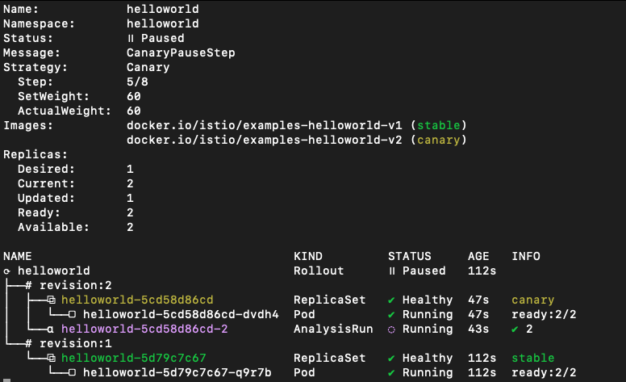
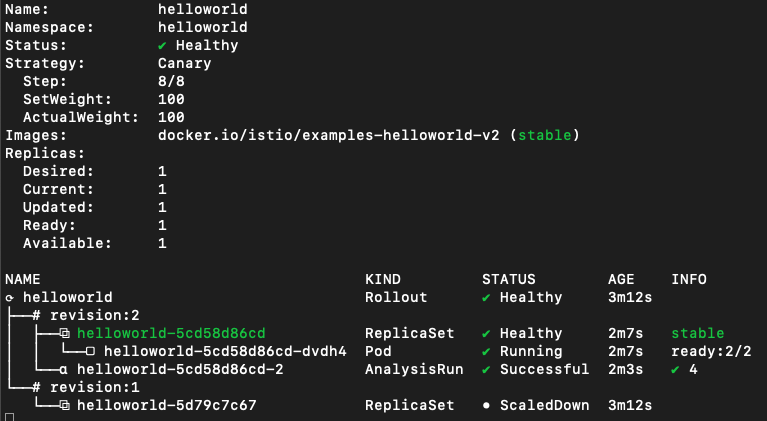

# Istio Multi-Primary with ArgoCD and Argo Rollouts with Federated Thanos

:mag: The _main_ branch of this repository uses AWS as Cloud Provider. Switch to _k8s-kvm_ branch to deploy the same lab in KVM.

This lab will consist on one mgmt cluster which will be named the hub cluster, in which we will have argoCD hub running.

We will have two workload clusters, in which we will install istio in multicluster primary-primary mode; each of the will have the helloworld-v1 application.

The purpose of this lab is making a canary upgrade of our helloword application from v1 to v2, using argocd rollouts. Both workload clusters will be sharing traffic, and rollouts will be consuming metrics of a federated prometheus on the mgmt cluster. 

So both apps deployed in workload clusters will perform the canary upgrade at the same time consuming same metrics in a multi-cluster approach.


## Deploy clusters
For this lab, three Kubernetes clusters are created in KVM:

| Name                 | Value                               |
| -----------          | -----------                         |
| Name hub cluster     | k8s-hub                             |
| Name cluster 1       | k8s-1                               |
| Name cluster 2       | k8s-2                               |
| cluster hub network  | 192.168.100.0/24                    |
| cluster 1 network    | 192.168.101.0/24                    |
| cluster 2 network    | 192.168.102.0/24                    |
| MetalLB cluster hub  | 192.168.100.150-192.168.100.175     |
| MetalLB cluster 1    | 192.168.101.150-192.168.101.175     |
| MetalLB cluster 2    | 192.168.102.150-192.168.102.175     |

An example of how to setup the enviroment can be found in this [repository](https://github.com/fperearodriguez/libvirt-k8s-provisioner).

## Install Istio Multi-Cluster

In our case we have installed istio Multi-Primary on different networks, following istio [docs](https://istio.io/latest/docs/setup/install/multicluster/multi-primary_multi-network/)

Please don't forget to [verify you installation](https://istio.io/latest/docs/setup/install/multicluster/verify/) deploying sample apps and making sure that you are able to reach both workload clusters from any of them.

Follow the [Istio README](./docs/README-istio.md) to configure Istio multicluster primary.

## Install ArgoCD and ArgoCD Rollouts
Follow the [Argo README](./docs/README-argocd.md) to configure ArgoCD and Argo rollouts.

### Argo Rollouts: Workload clusters

Install kubectl plugin: [Kubectl Plugin](https://argoproj.github.io/argo-rollouts/installation/#kubectl-plugin-installation).

Install Argo Rollout in both workload clusters:
```bash
kubectl --context="${CTX_CLUSTER1}" create namespace argo-rollouts
kubectl --context="${CTX_CLUSTER1}" apply -n argo-rollouts -f https://github.com/argoproj/argo-rollouts/releases/latest/download/install.yaml
kubectl --context="${CTX_CLUSTER2}" create namespace argo-rollouts
kubectl --context="${CTX_CLUSTER2}" apply -n argo-rollouts -f https://github.com/argoproj/argo-rollouts/releases/latest/download/install.yaml
```

## Deploy the monitoring stack

For the rollouts to be processed, we will point to a unique entry point of information.

For achieving this, we will deploy a Prometheus Operator per workload cluster, and Thanos in the hub cluster. 

We will federate thanos scraping metrics from both Prometheus Operators and query thanos from our Rollouts Deployments, so that both canary dpeloyments are upgraded with the same information.

Follow the [Monitoring README](./docs/README-monitoring.md) to configure the monitoring stack.

# Deploy Applications

The sample application and the Istio resources are deployed via ArgoCD. The _app of apps_ pattern is used to deploy them:

```bash
kubectl --context="${CTX_CLUSTERHUB}" apply -n argocd -f argocd-resources/helloworld-app-of-apps.yaml
```

By accessing the ArgoCD application created, the resources creation will be shown as follows:


## Upgrade the Application with Argo Rollouts

For upgrading our application, we will deploy a new ApplicationSet which consists of two Rollouts.

For applying it, execute the following command:

```bash
kubectl --context="${CTX_CLUSTERHUB}" apply -n argocd -f argocd-resources/rollouts-app-of-apps.yaml
```

You can check they have been created in both workload clusters:

```bash
kubectl --context="${CTX_CLUSTER1}" get rollouts.argoproj.io -A
NAMESPACE    NAME         DESIRED   CURRENT   UP-TO-DATE   AVAILABLE   AGE
helloworld   helloworld   1         1         1            1           54s
kubectl --context="${CTX_CLUSTER1}" get rollouts.argoproj.io -A
NAMESPACE    NAME         DESIRED   CURRENT   UP-TO-DATE   AVAILABLE   AGE
helloworld   helloworld   1         1         1            1           57s
```

If you want to check the context of the files, they consist on a rollout and an analysisTemplate.

The analysisTemplate will measure that we are getting more than 90% of request with 200 response_code for the new version:

```bash
apiVersion: argoproj.io/v1alpha1
kind: AnalysisTemplate
metadata:
  name: istio-success-rate
  namespace: helloworld
spec:
  args:
  - name: service
  - name: namespace
  metrics:
  - name: success-rate
    initialDelay: 60s
    interval: 20s
    successCondition: result[0] > 0.90
    provider:
      prometheus:
        address: http://a4c66330e34cc41cdb7cadf2f7ede153-1169737763.us-east-1.elb.amazonaws.com:9090
        query: >+
          sum(irate(istio_requests_total{
            reporter="source",
            destination_service=~"helloworld-canary.helloworld.svc.cluster.local",
            response_code!~"5.*"}[40s])
          )
          /
          sum(irate(istio_requests_total{
            reporter="source",
            destination_service=~"helloworld-canary.helloworld.svc.cluster.local"}[40s])
          )
```

For the rollout, we have the following file:

```bash
apiVersion: argoproj.io/v1alpha1
kind: Rollout
metadata:
  name: helloworld
  namespace: helloworld
spec:
  selector:
    matchLabels:
      app: helloworld
      service: helloworld
  template:
    metadata:
      labels:
        app: helloworld
        service: helloworld
    spec:
      containers:
      - name: helloworld
        image: docker.io/istio/examples-helloworld-v1
        ports:
        - name: http
          containerPort: 5000
          protocol: TCP
      serviceAccountName: helloworld
  strategy:
    canary:
      analysis:
        startingStep: 1   # index of step list, of when to start this analysis
        templates:
        - templateName: istio-success-rate
        args:             # arguments allow AnalysisTemplates to be re-used
        - name: service 
          value: helloworld-canary
        - name: namespace
          valueFrom:
            fieldRef:
              fieldPath: metadata.namespace
      canaryService: helloworld-canary
      stableService: helloworld 
      trafficRouting:
        istio:
          virtualService:
            name: helloworld
            routes:
            - helloworld
      steps:
      - setWeight: 10
      - pause: {duration: 20s}         # pause indefinitely
      - setWeight: 20
      - pause: {duration: 20s}
      - setWeight: 30
      - pause: {duration: 20s}
      - setWeight: 40
      - pause: {duration: 20s}
      - setWeight: 50
      - pause: {duration: 20s}
      - setWeight: 60
      - pause: {duration: 20s}
      - setWeight: 70
      - pause: {duration: 20s}
      - setWeight: 80
      - pause: {duration: 20s}
      - setWeight: 90
      - pause: {duration: 20s}
```

In this file, we specify that we will start with v1 of our helloworld application, and that we will use the service helloworld-canary for the new version of our application v2. We also specify the analysisTemplate to use and the VirtualService, as well as the weights for the different steps.

This will also deploy helloworld-v1 in both workload clusters, for testing you can make several calls to any of the Ingress Gateways of any workload cluster and you should see that the request hits helloworld-v1 in cluster1 and helloworld-v1 in cluster2. 

```bash
% curl http://helloworld-k8s-1.fperod.internal/hello
Hello version: v1, instance: helloworld-5d79c7c67-jhc4x
% curl http://helloworld-k8s-2.fperod.internal/hello
Hello version: v1, instance: helloworld-5d79c7c67-9pzmt
```

Once we reach this point, we are ready to start the rollout, so let's execute the following command to follow it up in the workload clusters:

```bash
kubectl --context="${CTX_CLUSTER1}" argo rollouts get rollout helloworld -n helloworld --watch
Name:            helloworld
Namespace:       helloworld
Status:          ✔ Healthy
Strategy:        Canary
  Step:          18/18
  SetWeight:     100
  ActualWeight:  100
Images:          docker.io/istio/examples-helloworld-v1 (stable)
Replicas:
  Desired:       1
  Current:       1
  Updated:       1
  Ready:         1
  Available:     1

NAME                                   KIND        STATUS     AGE    INFO
⟳ helloworld                           Rollout     ✔ Healthy  9m42s  
└──# revision:1                                                      
   └──⧉ helloworld-5d79c7c67           ReplicaSet  ✔ Healthy  9m42s  stable
      └──□ helloworld-5d79c7c67-xr8ll  Pod         ✔ Running  9m42s  ready:2/2
```

The idea of our setup now, is to make a change into the version of the rollout and commit change. This will trigger that the ApplicationSet defined in our mgmt cluster will notice that change and start the rollout of both remote clusters at exactly the same time, as we have only a single rollout that is spread across clusters thanks to the ApplicationSet. Also, as the analysisTemplate is taking the metrics from the mgmt cluster where we have the metrics federated, the VirtualService will also be changed at the same time in both workload clusters.

So let's change the version of our helloworld application with the following command:

```bash
sed -i 's/-v1/-v2/g' argocd-resources/rollouts/strategy/rollout.yaml
```

The only thing that would change would be the image in the spec:
```bash
    spec:
      containers:
      - name: helloworld
        image: docker.io/istio/examples-helloworld-v2
```

We just have to subbmit the changes in our github for making ArgoCD reconcile, depending on your Argo strategy you might need to sync your ApplicationSet:

```bash
git add argocd-resources/rollouts/strategy/rollout.yaml
git commit -m "upgrade app to version v2"
git push
```

Once sync, you will see that the Rollout is progressing, and if you check the command I provided before, you should see a green tick if everyhting is going well:



You can also check the VirtualService to see if the weights are changing:

```bash
apiVersion: networking.istio.io/v1beta1
kind: VirtualService
metadata:
  name: helloworld
  namespace: helloworld
spec:
  gateways:
  - istio-system/ingressgateway
  hosts:
  - '*'
  http:
  - match:
    - sourceLabels:
        app: istio-ingressgateway
        istio: ingressgateway
      uri:
        prefix: /hello
    name: helloworld
    route:
    - destination:
        host: helloworld
        port:
          number: 5000
      weight: 40
    - destination:
        host: helloworld-canary
        port:
          number: 5000
      weight: 60
```

When the rollout finishes, you will have something like this:



And every call you make will be forwarded to v2 version of applications in both workload clusters:

```bash
Hello version: v2, instance: helloworld-5cd58d86cd-w4c2q
Hello version: v2, instance: helloworld-5cd58d86cd-dvdh4
Hello version: v2, instance: helloworld-5cd58d86cd-w4c2q
Hello version: v2, instance: helloworld-5cd58d86cd-dvdh4
Hello version: v2, instance: helloworld-5cd58d86cd-w4c2q
Hello version: v2, instance: helloworld-5cd58d86cd-dvdh4
Hello version: v2, instance: helloworld-5cd58d86cd-w4c2q
Hello version: v2, instance: helloworld-5cd58d86cd-dvdh4
```

So we have managed to upgrade our Application in real time at the same time with the same metrics in multiple clusters using Istio, Thanos, ArgoCD and Rollouts!

Everything Open Source!

<h2 align="center">Contributors</h2>

[Edu Bonilla](https://www.linkedin.com/in/eduardo-bonilla-rodriguez-8868b8181/)                |  [Fran Perea](https://www.linkedin.com/in/francisco-perea-rodr%C3%ADguez-a3ba74105/)
:-------------------------:|:-------------------------:
 | 